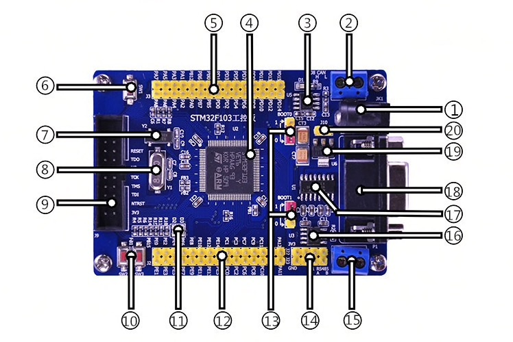

# STM32F103VET6

- Core: Cortex-M3 32-bit RISC
- Operating frequency: 72MHz
- Working voltage: 2-3.6V
- Packing: LQFP100; I/O port: 80
- Storage resources: 384kB Flash, 64kB RAM (103V with E suffix memory maximum)
- Interface resources: 3xSPI, 5xUSART, 2xI2S, 2xI2C, 1xFSMC, 1xLCD, 1xSDIO, 1xUSB, 1xCAN
- Analog-to-digital conversion: 3xAD (12-bit, 1us, time-sharing 16 channels), 2xDA (12-bit)

1. 5V power input, using DC2.1*5.5 standard female, input range 4-9V
2. CAN interface, it has been equipped with 120Ω (R3) between CANH/CANL
3. CAN chip, JTA1051
4. The CPU: STM32F103VET6, LQFP100 package
5. GPIO connector
6. Reset button
7. 32.768HZ crystal oscillator
8. 8MHZ crystal oscillator
9. JTAG port, designed according to JLINK standard port design
10. SW2, SW3 function button
11. D2, D3 indicator
12. GPIO export
13. BOOT boot setting options (BOOT0, BOOT1)
14. Power supply 3.3V, GND lead-out, convenient for other wiring
15. RS485 outlet
16. MAX3485 chip, it has been equipped with 120Ω (R2) between TR+/TR-
17. MAX3232 chip
18. Serial port header, DB9 female
19. AMS1117E-3.3v power chip
20. Auxiliary power input port

Some design issues with this board from online forums:
- I2C2 is unusable, because the RS485 is connected to UART3 (PB10/11)
- The RS485 select uses two lines, but typically RE and DE are connected anyway
- The USB port is not connected to PA10/11
- A pull-up is missing on the RX485 RXOUT (maybe the internal PU is fine), een with RE=low it might trigger weird RX interrupts.
- The RX485 has no bus bias resistors to Vdd and ground. This would be nice for a master.
- The LEDs and SW3 block the UART2, other pins would be available for that. SW2 blocks the 2nd SPI port, because of AN9.
- VBAT is not available as a separate pin and without modification, the RTC is useless, because you can't connect a battery cell.
- VREF is fixed to 3V3 and doesn't allow a reference voltage.
